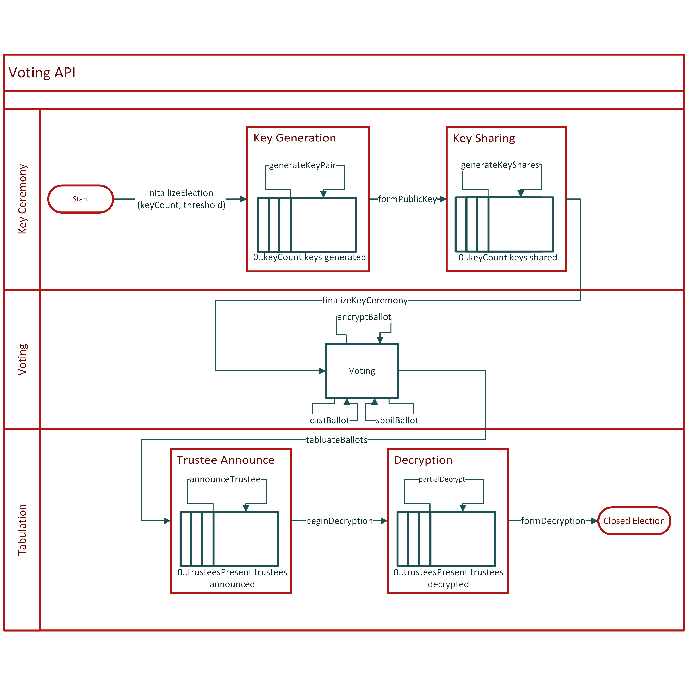
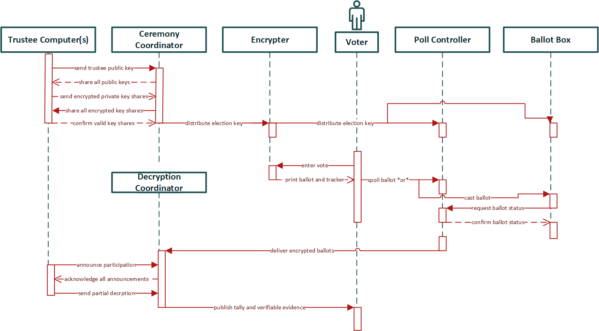
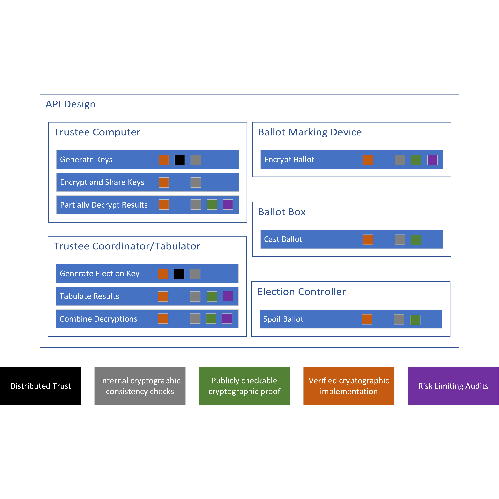

# Informal specifications

This directory contains informal specifications of the SDK.

Highlights are:

[A description](description/election.rst) of how an E2E-V election might run

Images of the state machine, process chart, and assurance layers

